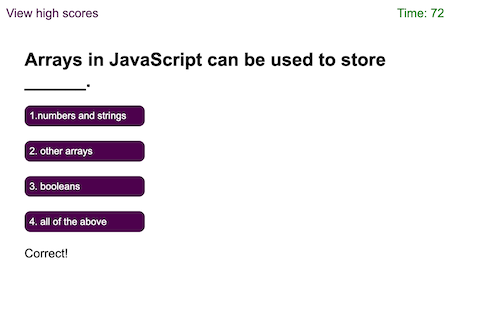
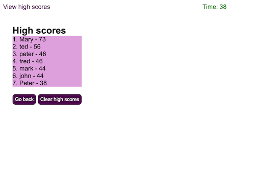

# codequiz
Coding Quiz
## Author: 
Mark Edwards

## Deployment:
[Live](https://mark-227-g.github.io/codequiz/)
### User Story:
```
AS A coding boot camp student
I WANT to take a timed quiz on JavaScript fundamentals that stores high scores
SO THAT I can gauge my progress compared to my peers
```
#### Acceptance Criteria
```
GIVEN I am taking a code quiz
WHEN I click the start button
THEN a timer starts and I am presented with a question
WHEN I answer a question
THEN I am presented with another question
WHEN I answer a question incorrectly
THEN time is subtracted from the clock
WHEN all questions are answered or the timer reaches 0
THEN the game is over
WHEN the game is over
THEN I can save my initials and score
```

#### screenshots
##### Step 1 - Initial start screen: Press start quiz to begin
##### 
##### Step 2 - Press the button of the correct answer
##### 
##### Step 3 - If it is the wrong answer then the wrong error message will be displayed.
##### 
##### Step 4 - If it is the right answer then the correct message will be displayed.
##### 
##### Step 5 - Continue answering question.
##### 
##### Step 6 - Continue answering question.
##### 
##### Step 7 - Enter your initials to save high score
##### 
##### Step 8 - View high scores. Press Go Back button to restart quiz or Clear high scores 
##### 

#### Technology used:
* HTML5 
*CSS3
* javascript 
* Deployed using github pages

#### References:

* [W3schools](https://www.w3schools.com/html/html5_semantic_elements.asp)
* [devicedocs](https://devdocs.io/css/)
* [javapoint](https://www.javatpoint.com/css-tutorial)


